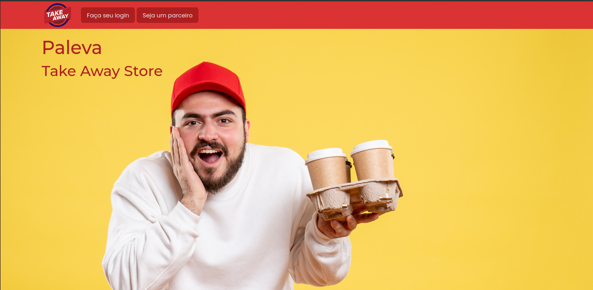
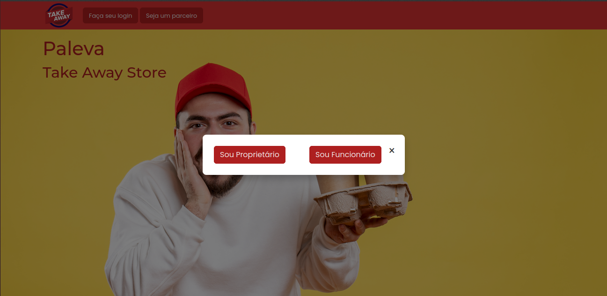
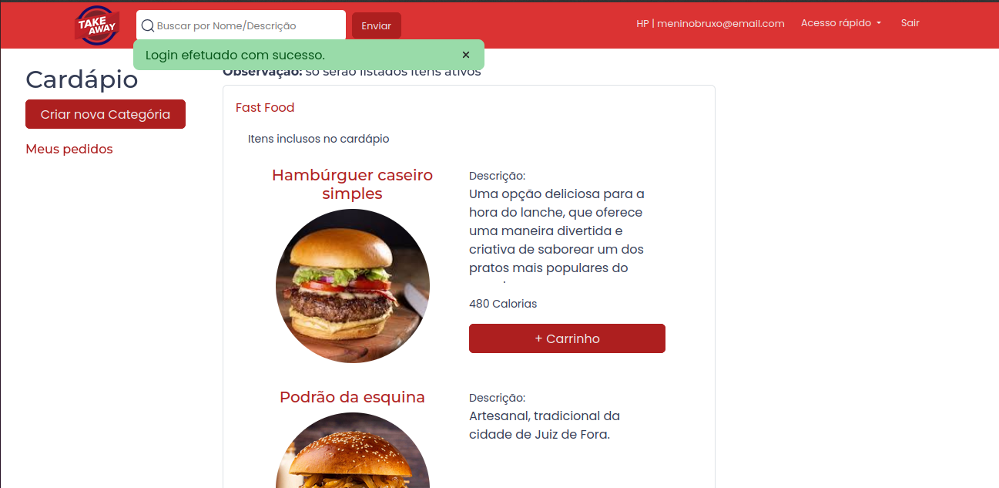
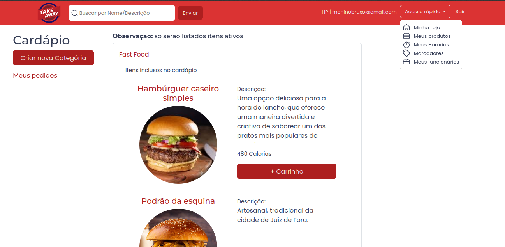

# Take Away Palevá

Está é uma aplicação para gerenciamento de Estabelecimentos do segmento Take Away, modelo oferecido no qual o consumidor opta por retirar seu pedido diretamente no estabelecimento. Este trabalho foi desenvolvido por Bruno Herculano através do TreinaDev13 ministrado por Campus Code.

## Tecnologias Necessárias
- [Ruby 3.2.1](https://www.ruby-lang.org/en/news/2023/02/08/ruby-3-2-1-released/)
- [Node v20.12.2 (LTS)](https://nodejs.org/en/blog/release/v20.12.2)
- [Rails 7.1.3.2](https://rubygems.org/gems/rails/versions/7.1.3.2)
- Sqlite3 3.37.2
- Yarn v1.22.22

## Aplicação

É disponibilizado o acesso de dois tipos de usuários: Proprietários, adminitradores do negócio, com alto grau de personalização; e Funcionários, usuários associados a um Estabelecimento com baixo grau de autorização.

## 1 - Gems Utilizadas
- [Rspec Rails](https://github.com/rspec/rspec-rails)
- [Capybara](https://github.com/teamcapybara/capybara)
- [Devise](https://github.com/heartcombo/devise)
- [Shoulda Matchers](https://github.com/thoughtbot/shoulda-matchers)
- [Rack Cors](https://github.com/cyu/rack-cors)
- Bootstrap
- Stimulus
- Turbo

## 2 - Configuração
1. Clone o repositório e entre na pasta do projeto:
   ```sh
   git clone https://github.com/Bruno-H-Terto/take_away_paleva.git
   ```
Pode ser necessários realizar a configuração do CORS para o consumo da API. Para isto vá em:

```
  \\ config > initializers > cors.rb

   allow do
    origins "http://127.0.0.1:5500"
  [...]
```
A aplicação já conta com a porta "http://127.0.0.1:5500" liberada para uso. Caso haja necessidade de se utilizar outra porta basta substituir ou adicionar a linha acima.

### 2.1 - Instalação e configuração do banco de dados:

1. Execute
   ```sh
    bundle install
    rails db:setup
    ```

A aplicação já conta com um proprietário registrado. Para o acesso utilize:

  email = 'meninobruxo@email.com 'e senha = 'treina_dev13';

## 3 - Execução de Testes

Para executar os testes, utilize o seguinte comando:
    ```
      rspec
    ```

(Os arquivos de testes estão localizados em ./spec)

## 4 - Aplicação
Visão geral sobre o funcionamento da aplicação:

### 4.1 - Proprietários


A aplicação conta com opções de acesso para Proprietários e Funcionários.



Funcionários são usuários vínculados, seu acesso só é possível através de um pré cadastro realizado por Proprietários.



Após a autenticação a página inicial será a de Cardápios. Nela são listados Cardápios registrados, seus itens e uma opção para gerar novos pedidos com a inclusão de itens ao carrinho.

* Observação: Para usuários sem registro ativo de Estabelecimento e Horários, antes da visualização de destas funcionalidades os mesmos serão direcionados as telas correspondetes ao cadastro.



Na barra de navegação superior à direita estão localizadas opções para visualização de detalhes do Estabelecimento, Horários, Produtos, Tags e Funcionários.

### 4.2 Funcionários

O acesso de Funcionários é idêntico ao de Proprietários com exceção da listagem de funções na barra de navegação. Funcionário só são permitidos a visualizarem Cardápios e gerarem novos pedidos.

## API

A api conta com 7 Endpoint's. Sendo destes, 2 para Estabelecimentos e 5 para pedidos.

### Autenticação

Não é necessário autenticação para o consumo da API.

### 1 - Estabelecimentos
#### GET api/v1/stores

Este endpoint retorna uma mensagem de solicitação para do código do Estabelecimento. Optou-se por não realizar a listagem de todos os Estabelecimentos:

* status: 200
* content-type: application/json
```
json
{
  "error_message":"Informe o código do   Estabelecimento"
}
```
#### GET api/v1/stores/:code

Endpoint para acesso a um Estabelecimento específico. O parâmetro esperado é o código único gerado durante o cadastro de um novo Restaurante.

* status: 200
* content-type: application/json
```
json
{
  "store":
    {
      "id":1,
      "trade_name":"Pedra Filosofal",
      "corporate_name":"Hogwarts LTDA",
      "register_number":"76.898.265/0001-10",
      "street":"Beco diagonal","number":"13",
      "district":"Bolsão","city":"Hogsmeade",
      "state":"SP","zip_code":"11000-000",
      "complement":"",
      "phone_number":"(11) 98800-0000",
      "email":"potter@email.com",
      "code":"GKUPCH",
      "owner_id":1
    }
}
```
* Resposta
  - id: id único do Estabelecimento;
  - trade_name: Nome Fantasia;
  - corporate_name: Razão Social;
  - register_number: CNPJ;
  - street: Logradouro;
  - district: Bairro;
  - city: Cidade;
  - state: Estado;
  - zip_code: CEP;
  - complement: Complemento;
  - phone_number: Número de telefone;
  - email: E-mail;
  - code: Código;
  - owner_id: id único do Proprietário.

### 2 - Pedidos

#### GET /api/v1/stores/:store_code/orders
Endpoint para listagem de pedidos de um Restaurante.

* status: 200
* content-type: application/json

```
json
[
  {
    "id":1,
    "code":"IPHF9Z1A",
    "name":"Jhon",
    "status":"waiting_confirmation",
    "take_away_store_id":1,
    "created_at_current":"2024-11-22T05:14:27.217-03:00",
    "total":6000
  },
  {
    "id":2,
    "code":"BCDF9Z2A",
    "name":"Maria",
    "status":"done",
    "take_away_store_id":1,
    "created_at_current":"2024-11-22T05:14:27.217-03:00",
    "total":8000
  }
]
```

* Resposta
  - id: id único do Pedido;
  - code: Código do Pedido;
  - name: Nome do Cliente;
  - status: Status do Pedido;
  - take_away_store_id: id do Estabelecimento;
  - created_at_current: data de Criação do pedido com fuso;
  - total: Valor total do pedido;

#### GET /api/v1/stores/:store_code/orders/status

Endpoint destinado a filtragem na listagem de pedidos. Sua resposta segue as mesmas especificações da resposta para listagem geral. O filtro deve ser passago via parâmetro, sendo em caso de um parâmetro desconhecido ser passado o retorno será a listagem total.

* Parâmetros aceitos
- waiting_confirmation: para pedidos aguardando confirmação;
- preparing: Pedidos confirmados;
- done: Pedidos prontos;
- canceled: Pedidos cancelados;
- finished: Pedidos finalizados.

* Exemplo de requisição

```
http://localhost:3000/api/v1/stores/GKUPCH/orders/status?=waiting_confirmation
```
#### GET /api/v1/stores/:store_code/orders/:code

Exibe Detalhes de um pedido através de seu código.

* status: 200
* content-type: application/json

```
json
{
  "order":
  {
    "id":1,
    "code":"IPHF9Z1A",
    "name":"Jhon",
    "phone_number":"(11) 11111-1111",
    "register_number":"",
    "email":"",
    "status":"waiting_confirmation",
    "take_away_store_id":1,
    "created_at_current":"22/11/24 - 05:14",
    "total":6000
  },
  "order_items":
    [
      {
        "menu":"Fast Food",
        "item":"Hambúrguer caseiro simples",
        "portion":"Média - R$ 60,00",
        "observation":"ok",
        "quantity":1
      }
    ]
  }

```

* Resposta
  - id: id único do Pedido;
  - code: Código do Pedido;
  - name: Nome do Cliente;
  - status: Status do Pedido;
  - take_away_store_id: id do Estabelecimento;
  - created_at_current: data de Criação do pedido com fuso;
  - total: Valor total do pedido;
  - phone_number: Telefone do Cliente
  - email: E-mail do Cliente;
  - register_number: CPF do Cliente;
  - Uma lista presente em order_items com todos o items do pedido, contendo: Cardápio, Produto, Porção, Observação e Quantidade.

#### PATCH /api/v1/stores/:store_code/orders/:code/confirmed

Endpoint para confirmação de Pedidos. Um pedido aguardando confirmação tem seu status alterado para 'preparing'. Não é necessário a passagem de nenhum parâmetro além dos já mencionados.

* status: 200
* content-type: application/json

Sua resposta é idêntica a de detalhes do pedido, apenas com a diferença que o status é atualizado.

#### PATCH /api/v1/stores/:store_code/orders/:code/done

Endpoint para conclusão de Pedidos. Um pedido confirmado tem seu status alterado para 'done'. Não é necessário a passagem de nenhum parâmetro além dos já mencionados.

* status: 200
* content-type: application/json

Sua resposta é idêntica a de detalhes do pedido, apenas com a diferença que o status é atualizado.

#### PATCH /api/v1/stores/:store_code/orders/:code/canceled

Endpoint para cancelamento de Pedidos. Um pedido confirmado ou aguardando confirmação tem seu status alterado para 'canceled'. É necessário a passagem de um parâmetro além dos já mencionados. O parâmetro esperado é "reason" (justificativa), sem esse parâmetro o cancelamento não pode ser realizado.

* status: 200
* content-type: application/json

* Exemplo de requisição

```
http://localhost:3000/api/v1/stores/GKUPCH/orders/IPHF9Z1A/canceled?=Exemplo
```

Sua resposta é idêntica a de detalhes do pedido, apenas com a diferença que o status é atualizado.

### Falhas

Em caso de falha para qualquer requisição com parâmetro não encontrado é retornado a seguinte resposta:
  * status: 404
  * content-type: application/json
  ```
  json
  {
    "error_message":"Recurso não localizado"
  }
```
Em uma eventual indisponibilidade do servidor é retornado a seguinte resposta:
 * status: 500
 * content-type: application/json

 ```
  json
  { 
    error_message: 'Ocorreu um erro interno' 
  }
 ```